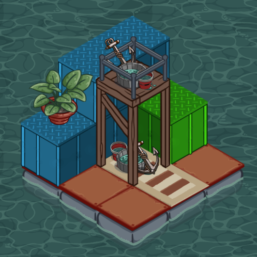
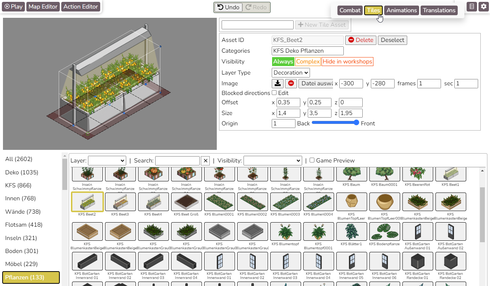
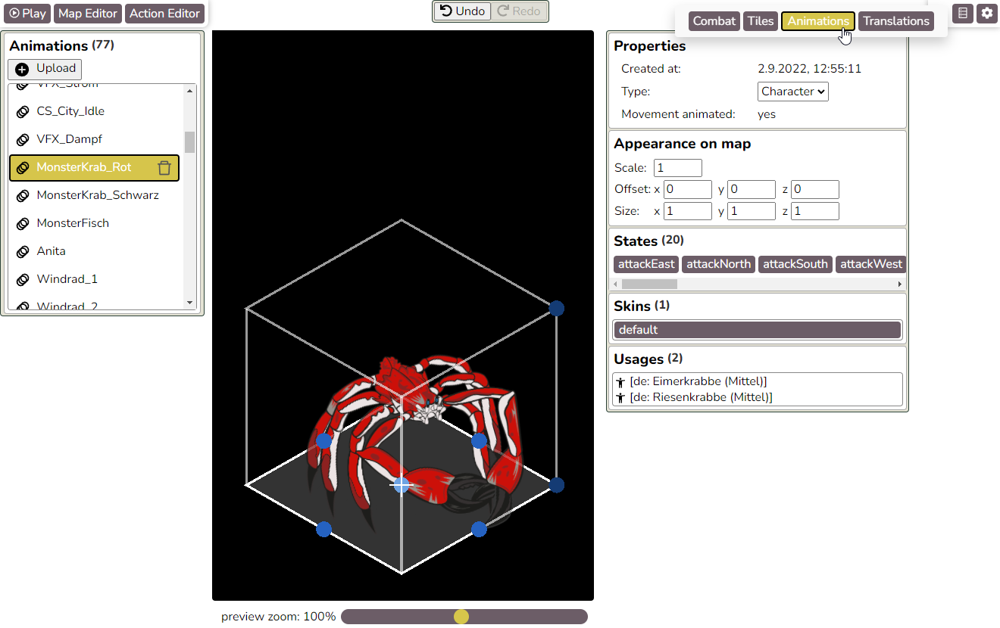

# Code Overview

## Table of Contents

- [The different parts of the editor](#the-different-parts-of-the-editor)
- [Technologies used](#technologies-used)
- [Folder structure](#folder-structure)
- [Real-time collaboration](#real-time-collaboration)
- [Undo/redo](#undoredo)
- [User roles](#user-roles)
- [Optimizations on the client](#optimizations-on-the-client)
  - [Asset caching](#asset-caching)
  - [Viewport culling](#viewport-culling)
  - [Fixing GPU upload stuttering](#fixing-gpu-upload-stuttering)
- [Optimizations on the server](#optimizations-on-the-server)
  - [Texture atlas generation](#texture-atlas-generation)
  - [Tile thumbnail generation](#tile-thumbnail-generation)
- [Isometric depth ordering](#isometric-depth-ordering)

## The different parts of the editor

Before reading more about the code, getting [a quick overview over the different parts of the editor](using-the-editor.md) will help you get a good overall feeling for the project.

## Technologies used

### Shared between frontend and backend
- [TypeScript](https://www.typescriptlang.org) - Strongly typed JavaScript.
- [MobX](https://mobx.js.org) - State management, allowing code to react to changes, e.g. a component rerenders itself, but only when relevant data changes. Used for pretty much all client app state.
- [mobx-keystone](https://mobx-keystone.js.org) - MobX, but more structured, allowing things like serialization and patch generation. Used for all content that is synchronized with the server, e.g. game maps, tile asset configuration data, character configurations etc.
- [Socket.IO](https://socket.io) - WebSocket library. Used for real-time communication between client and server.

### Frontend
- [PixiJS](https://pixijs.com) - WebGL rendering engine.
- [React](https://react.dev) - Library for building user interfaces based on components. Used for both the editor and most of the in-game UI.
- [styled-components](https://styled-components.com) - CSS-in-JS library - creates components directly from CSS.
- [react-i18next](https://react.i18next.com) - Frontend localization.

### Backend
- [Node.js](https://nodejs.org) - Backend runtime.
- [Express](https://expressjs.com) - Web server framework.
- [Sequelize](https://sequelize.org) / [sequelize-typescript](https://github.com/sequelize/sequelize-typescript) - Database integration.
- [Umzug](https://github.com/sequelize/umzug) - Database migrations.

### Building & development tools

- [webpack](https://webpack.js.org) - Compiling/transpiling/bundling the TypeScript frontend app so it can be opened in browsers.
- [Jest](https://jestjs.io) - Unit testing.

### Database & Services

- [MariaDB](https://mariadb.org) - Relational database.
- [Sentry](https://sentry.io) - Error monitoring.
- [New Relic](https://newrelic.com) - Monitoring.

## Folder structure

- `assets` - Static assets (e.g. editor localization files, game UI, fonts)
- `documentation`
- `src`
  - `client`
    - `cache` - IndexedDB cache support for images
    - `canvas` - PixiJS WebGL app parts of game, map editor, animation editor etc.
    - `communication` - Socket.IO clients + REST api calls
    - `components` - React components
    - `data` - Constants and data structures
    - `gameengine` - The engine that executes action trees in the game
    - `helper` - Small helper files
    - `integration` - Various integrations for services like local storage or localization
    - `interaction` - Movement and pathfinding
    - `stores` - MobX stores, holding the whole application state
      - `undo` - Undo/redo system
    - *`client.tsx`* - The main file of the client
  - `server`
    - `communication` - Socket.IO servers + logic
    - `data` - The server state (game maps, action trees, game assets etc.)
    - `database` 
      - `databaseMigrations` - All database migrations, automatically found and executed via Umzug on server start
      - `models` - The sequelize-typescript models of the things we save in our database
    - `helper` - Small helper files
    - `integrations` - Various integrations for services like monitoring or logging
    - `optimization` - Tile image atlas and thumbnail generation
    - `routes` - The various REST routes, for everything not handled in real-time by Socket.IO
    - `security` - Rate limiters
    - `tools` - Files to be run manually for debugging, analysis or other tasks
    - *`main.ts`* - The main file of the server
  - `shared` - Code shared between client and server. Mainly mobx-keystone models that define resources, e.g. "game map" or "tile asset".
  - `tests` - Jest unit tests. Mirrors the `src` folder structure.
- `tools`
  - `root-ca-generation-windows` - Generate a root certificate authority for [running a local server in the network](../README.md#run-the-server-from-a-laptop-in-the-local-network)
- `views`
  - `page.ejs` - The template for our single-page application

## Real-time collaboration

In the workshops, multiple participants work on the same "module", i.e. on game maps, action trees, characters and items that are shared between them. To keep conflicts minimal and to ensure that everyone can see and work with the newest state, the whole editor is real-time collaborative: Any change made is instantly propagated everywhere.

To make it real-time we use [Socket.IO](https://socket.io), a websocket library. Clients send any changes they make to the server The server then approves or denies the changes, and if approved sends them to all other clients.

Most changes are sent as a pair of patches generated by [mobx-keystone](https://mobx-keystone.js.org) (and further augmented by our code; see [mobXHelpers.ts](/src/shared/helper/mobXHelpers.ts)) - one patch for the change made, and one patch that would reverse the change.

A pair of patches that adds a new English text string to a dialogue node in the action editor might look like this:

```
"patch": {
    "op": "add",
    "path": [
        "nonSubTreeActions",
        {
            "arrayIndex": 53,
            "$modelId": "zk-NA56GnxKQXOjdrjKTB3cbw=="
        },
        "answers",
        {
            "arrayIndex": 0,
            "$modelId": "101-NA56GnxKQXOjdrjKTB3cbw=="
        },
        "value",
        "text",
        "items",
        "en"
    ],
    "value": "This is a new answer text"
}
"inversePatch": {
    "op": "remove",
    "path": [
        "nonSubTreeActions",
        {
            "arrayIndex": 53,
            "$modelId": "zk-NA56GnxKQXOjdrjKTB3cbw=="
        },
        "answers",
        {
            "arrayIndex": 0,
            "$modelId": "101-NA56GnxKQXOjdrjKTB3cbw=="
        },
        "value",
        "text",
        "items",
        "en"
    ]
}
```

- `op` is one of "add", "remove" or "replace"
- `path` leads to the object/property that is changed
- `value` contains the new value to be added or replaced with

The inverse patch is used to see whether the old state is still valid or whether the change was made based on an outdated version (in which case the change will get rejected). The patch itself will then be used to change the state on the server before it is forwarded to all other clients.

The system requires a one-time setup for every new entity type:
- Shared
    - A mobx-keystone model class (e.g. [CombatConfigurationModel.ts](/src/shared/combat/CombatConfigurationModel.ts)).
    - [Socket.IO routes](/src/shared/definitions/socket.io/socketIODefinitions.ts)) for sending patches between client and server, and for creating/deleting/undeleting new entities if there is more than one.
- Server
    - The implementation of the socket routes in [EditorServer.ts](/src/server/communication/EditorServer.ts) to change the data on the server and to broadcast it to other clients.
    - A new database model (e.g. [CombatConfiguration.ts](/src/server/database/models/CombatConfiguration.ts)) and a migration to create the database table (see the [databaseMigrations](/src/server/database/databaseMigrations/) folder).
    - Adding the instances to the [ServerState.ts](/src/server/data/ServerState.ts).
    - Regularly saving the instances to the database via [db.ts](/src/server/database/db.ts).
- Client
    - The implementation of the socket routes in [EditorClient.ts](/src/client/communication/EditorClient.ts).
    - A patch tracker that automatically generates patches on change, stored in [EditorClient.ts](/src/client/communication/EditorClient.ts). Either created for every entity upon creation or individually started/stopped via useEffect() from the React components responsible for editing the content.
    - An undo operation class for every action, like "create", "delete", "undelete" or "change" (e.g. [CombatConfigurationSubmitChangesOp.ts](/src/client/stores/undo/operation/CombatConfigurationSubmitChangesOp.ts)).

This might seem like a lot of work, but for the most part it is rather straightforward to implement and only has to be done once per entity type. After this initial setup is done, using and modifying those entities is completely trivial in most cases:

- To change data and have it instantly reflected on all clients, all you need to do is set the data directly: `combatConfiguration.setBonusDamage(10);`
- To add a new field to an entity type, all you have to do is add it to the model: `playerSpeed: prop<number>(3).withSetter()`

If the model scheme changes are more complicated than adding or removing a field, a [migration](/src/server/database/databaseMigrations/) can be used.

## Undo/redo

The undo/redo system is roughly based on the [Command pattern](https://refactoring.guru/design-patterns/command). It consists of the following parts:

- The [UndoStore](/src/client/stores/undo/UndoStore.ts) manages the undo/redo queues.
- Every action the user can make has an implementation of [UndoableOperation](/src/client/stores/undo/UndoableOperation.ts):
    - `constructor(public readonly name: string)`
        - Sets the localization key for the undo entry.
    - `public abstract execute(isRedo: boolean): Promise<void>`
        - Executes the change, initially and on redo.
    - `public abstract reverse(): Promise<void>`
        - Reverses the change.
    - `public merge(previousOperation: UndoableOperation): boolean`
        - Tries to merge this UndoableOperation with the previous one, e.g. for when a text is slowly changed: ("" -> "T"), ("T" -> "Te"), ( "Te" -> "Tex") and ("Tex" -> "Text") becomes ("" -> "Text) after the merge, so that the user doesn't have to press Undo multiple times. Merging is automatically inhibited by the UndoStore when the user clicks anywhere.

There are also specialized helper classes and functions to facilitate easy merging and grouping of patches (see [Real-time collaboration](#real-time-collaboration)) which result from mobx-keystone model changes.

## User roles

Unfortunately there was not enough time to implement a proper user-based system. The system instead provides access codes for several role levels:

- Admin: May access everything, including workshop management. May edit the main game content and global settings.
- Workshop admin: May edit a single specific workshop, add modules and edit the game content of the workshop's modules.
- Workshop participant: May edit the game content of a single module.
- Workshop/module player: May play the game with the content one or more modules.
- Public (not logged in): May play the main game.

If there is ever an opportunity to work further on this project: a user-based system would be greatly preferable.

See [Using the Editor: Workshop Management](./using-the-editor.md#workshop-management) for more on workshops/modules.

## Optimizations on the client

### Asset caching

One problem we faced is that schools often have slow internet, which means preloading our images, animations and sounds (so that they are available when needed, instead of regularly having to wait every time you want to place a tile or an animation) took a long time.

Automatic browser image caching is unreliable with large amounts of data. For example, in experiments it seemed that Google Chrome simply flushes its cache once it reaches a certain size.

Instead, we are using [IndexedDB](https://developer.mozilla.org/en-US/docs/Web/API/IndexedDB_API) to store downloaded assets. Those stored assets are saved with a version number/string. Requests to the server are only sent if the correct version isn't available in the cache.

(As a side note: Another way problems with a slow or unstable internet connection can be solved is by [running a local server](/README.md#about-running-a-local-server).)

### Viewport Culling

To effectively render big game maps, only visible areas should be drawn. That is what our [culling system](/src/client/canvas/shared/optimization/Culling.ts) is doing.

- If the object position is far outside of the viewport, the object isn't drawn. (For most objects; some are very big, so this "early rejection" system is turned off for them.)
- If the object position is inside the viewport, the object is drawn.
- If the object position is not inside the viewport, but close to it, the object is drawn only if the local bounding box overlaps with the viewport.
  - For most objects, local bounding boxes are [cached](/src/client/canvas/shared/optimization/StaticLocalBoundsContainer.ts).

### Fixing GPU upload stuttering

Uploading textures to GPU memory is an expensive synchronous process. Especially on bigger maps, walking around often lead to small micro-lags when new tiles came into view. Worse still, textures of sprites that weren't seen for a while were regularly garbage-collected, so the micro-lags will continue to happen even if the player doesn't leave the map.

Our current solution to this problem consists of two parts:
- Render all sprites on the map once while showing the map loading screen, thereby loading every texture necessary into the GPU memory.
- Turning off the automatic texture garbage collection cycles, and manually trigger a cycle while the user is switching maps.

We also tried texture compression (if the tiles are in a format that can easily be read the graphics card, the upload to GPU memory card is faster), but that lead to much higher RAM consumption due to the very high number of tiles we have, so we decided to not further pursue this approach at the moment.

## Optimizations on the server

### Texture atlas generation

To speed up preloading times, we experimented with automatic texture atlas generation using [free-tex-packer-core](https://github.com/odrick/free-tex-packer-core). However, since users build maps out of freely chosen tiles, we couldn't determine good atlas compositions, and our experiments even lead to crashes on bigger maps because too many different atlases had to be loaded into GPU memory at the same time. For that reason we're not currently using atlas generation.

The atlas generation itself worked quite well though, and is still available in the [atlasPacker.ts](/src/server/optimization/atlasPacker.ts).

### Tile thumbnail generation

We generate our own tile thumbnails for the UI: [thumbnailGenerator.ts](/src//server/optimization/thumbnailGenerator.ts).

## Isometric depth ordering

Sorting objects on isometric maps that are bigger than 1x1 is surprisingly non-trivial.

We first tried an approach where we cut tile images into 1x1 slices. This made determining the drawing order extremely easy, but had several disadvantages:
- Loading the cut images one by one from the server and into memory took several times longer compared to just using the original images.
   - This could potentially be resolved by generating an texture atlas from the cut slices, but the result will still be bigger than the original image.
- Generating the cut images took some time, and this had to be triggered again for many kinds of changes to tiles.
- Big objects like e.g. a ship lead to many, many draw calls, which decreases performance.
- Cutting images doesn't work well for animated tiles, and not at all for Spine animations.
- Sometimes we had small gaps when rendering sprites at certain zoom levels during movement - probably rounding errors.

In the end, we opted for an approach based on what is described [here](http://shaunlebron.github.io/IsometricBlocks). Essentially, each object (i.e. tiles, characters, animations) on the map have an axis-aligned 3d bounding box, and the order of non-intersecting boxes can be determined by separating each pair of boxes by imagining a small plane between them (see Figure 5 in the link above).

For our use case we also had to add functionality for overlapping boxes (e.g. decoration on a tile), flat objects (e.g. a carpet on the floor or a poster on the wall) and for manually sorting overlapping objects on the map on a case-by-case basis when the default doesn't look good (by using origin points for non-flat and z-index for flat objects).

This system allows relatively complex arrangements to resolve with minimal user intervention. Everything you see in the image below is a separate floor tile, decoration tile or animation: Floor tiles, carpet, containers, anchor, bucket, fences etc.



Bounding boxes are set in the [Tile Editor](./using-the-editor.md#tile-asset-editor) and the [Animation Editor](./using-the-editor.md#animation-editor):





The code responsible for the sorting can be found in [/src/client/canvas/shared/map/sorting](/src/client/canvas/shared/map/sorting).