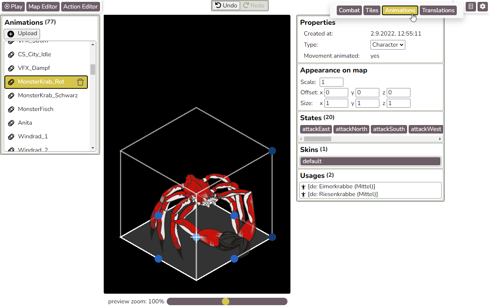

# A quick overview of the different parts of the editor

The editor consists of many sub-editors and other places where settings can be changed:

- [Map editor](#map-editor)
- [Action editor](#action-editor)
- [Tile asset editor](#tile-asset-editor)
- [Animation editor](#animation-editor)
- [Character editor](#character-editor)
- [Combat settings](#combat-settings)
- [Global settings](#global-settings)
- [Translation management](#translation-management)
- [Workshop management](#workshop-management)

## Map editor

In the map editor, users create game maps consisting of:
- **Tiles**, which can be used as floor or as static decoration objects.
- **Characters**, which can move around on the map and interact with the player.
- **Animations**, which are animated decoration objects.
- **Map Markers**, to mark places where things should happen (referenced in the action editor for things like "Character walks to here" or "A quest marker should be here").
- **Area Triggers**, which can sense if the player walks into them.
- **Start Marker**, where the player should spawn by default when the map opens in the game.
- **Debug Start Marker**, for a temporary override of the player start position for debugging purposes.

Additionally, decoration tiles, characters and animations can become "interaction triggers", which means the player can interact with them via a clickable interaction bubble.

## Action editor

The action editor is a visual programming environment where users can reference objects on the map, adding logic to them.

In the example below, once the player enters the area trigger "Stadtwache_Sicht" (the view area of the city guard), a dialogue will pop up. Depending on what the player answers, the action tree will continue on with different branches, e.g. checking whether the player has a certain item or starting a fight, and so on.

Inside the action editor, items that the player can receive and use can be created:

## Tile asset editor

Tiles are either floor or static decoration objects. They can be placed on maps in the map editor. In the tile asset editor, new tiles can be uploaded and configured.

## Animation editor

In the animation editor, new animations (made with [Spine](http://esotericsoftware.com)) can be uploaded and configured.

Animations can be:
- Placed on maps in the map editor.
- Used to make characters in the character editor.
- Played as cutscenes from the Cutscene node in the action editor.

## Character editor

In the character editor (available from the map editor), new characters can be created.

These characters can then be placed on maps in the map editor, where players can interact with them or fight them.

Combat presets that can be shared between multiple enemies can also be edited here.

## Combat settings

In the combat settings, global settings for the combat can be configured.

## Global settings

In the options menu (cog wheel in the upper right), global non-combat settings for the game can be configured.

## Translation management

The translation management can export and import CSV files to translate game content, and shows statistics how far along translations are in different languages.

## Workshop management

One of the intended use cases of the Adamara editor is allowing workshop participants to add content to the main game or to create their own small standalone adventures using our assets.

The basic structure is:
- Workshop organizers create one "workshop" for each real-life workshop event.
- Inside the workshop, the organizer creates one or more "modules", usually one per participant team.
  - Each module is a standalone experience or an add-on for the main game, and has its own action tree, maps, characters and items.
  - Add-on modules for the game slot into certain places called "gates" inside the main game (e.g. an interactable character or an area trigger).
  - Workshop organizers can decide if the workshop participants are playing the main game with or without other people's modules as add-ons.

